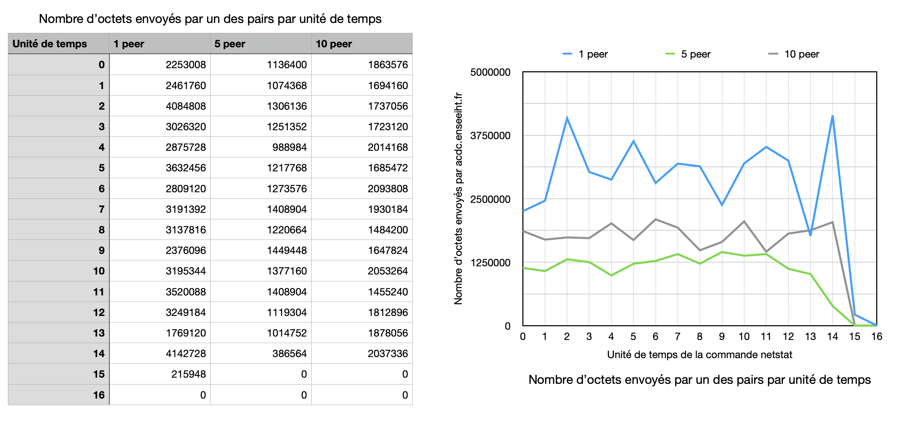

# Projet HagiMule

**Théo Bessel & Nell Truong**

Ce projet a pour but d'implanter une architecture de téléchargement parallèle de grands fichiers.

Il a été réalisé dans le cadre du cours d'intergiciel et données réparties donné en deuxième année à l'N7.

## Installation

Via gradle :

Lancer la commande suivante pour compiler le projet sous forme d'archives Java :
```bash
gradle jar
```

## Architecture globale

Le projet possède trois composants principaux :

#### 1 / `Diary` /

Le `Diary`, ou annuaire, est un serveur accessible par RMI qui répertorie les fichiers des clients connectés ce qui permet l'orchestration des téléchargements.

À chaque connexion d'un client, il enregistre les fichiers proposés par ce dernier.

**1.1/ `UploadService` /**

L'`Upload` est un service tournant en parallèle du Daemon, celui-ci ce charge de récupérer les requêtes de fichiers qu'il reçoit et transfère les fichiers au demandeur via une connection TCP.

**1.3/ Heartbeats : `AliveClientsService` /**

Un mechanisme de *heartbeat* vérifie que les clients sont bien connectés, afin de savoir quel client est toujours disponible avec pour les fichiers, il supprime un owner du diary si celui-ci semble déconnecté.

#### 2 / `Daemon` /

Le `Daemon` tourne sur chaque client et permet le téléchargement de fragments de fichiers via des sockets TCP.

Ce dernier est une sorte de serveur qui tourne sur chaque client et expose des fragments de fichiers à la demande.

**2.1/ Heartbeats : `HeartbeatService` /**

Un mechanisme de *heartbeat* vérifie que le diary est bien connecté, afin de pouvoir continuer à envoyer et télécharger des fichiers. Si le diary n'est plus connecté, alors il tente une reconnection toutes les secondes.

**2.2/ `DirectoryWatcher` /**

Le `DirectoryWatcher` est un service associé au démon tournant en parallèle de celui-ci. Il surveille le dossier */downloads* où sont stockés les fichiers transimissibles et où sont téléchargés les fichiers.

#### 3 / `Download` /

Le `Downloader` tourne sur chaque client et permet à ce client de téléchager de manière parallèle des fichiers proposés par d'autre clients.

Ce dernier communique donc avec les `Daemon` des autres clients (ou du moins leur `UploadService` asssocié).

## Elements annexes

#### 1 / `FileInfo` /

`FileInfo` est notre interface représentant les fichiers pour le diary. Un fichier représenté par FileInfo possède : un nom, une taille et une liste de client (`ClientInfo`) le possédant.

#### 2 / `Fragment` /
De même, pour le téléchargement des fichiers, ceux-ci sont téléchargés par fragments, qui sont alors représentés par un `FileFragment` et possèdent : un nom, une taille, un offset et un client propriétaire.

#### 3 / `ClientInfo` /

Les clients sont eux représentés par un un `ClientInfo` et possède une adresse et un port.

## Evaluation des performances

Pour évaluer les performances de notre modèle de peer to peer nous avons mis en place un script de déploiement utilisant les machines de l'N7.

Nous avons décidé de garder le débit réseau intact (en ne créant donc pas un ralentissement artificiel) et nous avons donc décidé de ne pas mesurer le temps d'exécution du téléchargement mais une autre grandeur plus pertinente dans le cas d'un très bon réseau comme celui de l'école.

Nous avons alors mesuré (grâce à la commande netstat) le nombre d'octets envoyés par l'interface réseau d'un des peers, au peer qui effectue un téléchargement. Nous avons fait ces mesures au cours du temps de téléchargement et en faisant varier le nombre de peers pour obtenir les trois courbes suivantes :



Les mesures ont été faites sur le transfert d'une image tirée de Wikipédia, pesant approximativement 400Mo et pour 1, 5 et 10 peers. (1 peer correspondant à un téléchargement n'étant pas parallèle qui servira donc de référence)

On constate alors deux choses :
- Lorsque l'on utilise plusieurs peers, on obtient de meilleures performances qu'en téléchargement monothreadé; jusqu'à environ deux fois plus rapide pour 5 peers dans notre cas.
- À partir d'un certain nombre de peers, cette méthode perds en efficacité, cela est probablement dû à une saturation de la carte réseau de la machine qui télécharge le fichier, amplifiant alors le nombre de requêtes TCP en timeout et donc le nombre de paquets envoyés à nouveau à cause de ce timeout.

On peut donc conclure en disant que le peer to peer est une excellente méthode dans le cas où on a un client voulant télécharger un fichier présent sur plusieurs machines ayant un bien moins bon réseau en upload que lui en download. On mets alors à profis la parallélisation de ces peers pour se rapprocher de la capacité maximale de download de la machine effectuant le téléchargement

## Utilisation

Pour utiliser le projet, trois manières sont possibles:

### Lancement avec un .jar

Compiler le projet avec Gradle :
```
gradle jar
```
Note : ceci peut aussi être fait avec le wrapper Gradle `./gradlew jar` et chaque composant peut être individuellement compilé, par exemple `gradle Diary:jar` compile le Diary.

#### Lancement du diary

Sur la machine hébergeant le diary, choisir le port pour la connection RMI:
```bash
export RMI_PORT=<port>
```
Où `<port>` est à remplacer par le port à utiliser.

On peut lancer le diary avec la commande:
```bash
java -jar Diary/build/libs/Diary.jar
```

#### Lancement d'un client

Renseigner l'adresse du diary, son port et le port TCP à utiliser:
```bash
export RMI_IP=<adress>
export RMI_PORT=<port1>
export TCP_PORT=<port2>
```

On peut par exemple remplacer `<adress>` par `iode.enseeiht.fr`, `<port1>` par `5021` et `<port2>` par `5022`. Attention, il faut bien penser à mettre le même port RMI que sur la machine hébergeant le diary.

On lance le Daemon du Client:
```bash
java -jar Daemon/build/libs/Daemon.jar
```

### Lancement d'un téléchargement

Renseigner l'adresse du diary et les ports à utiliser (identique au client).
```bash
export RMI_IP=<adress>
export RMI_PORT=<port1>
export TCP_PORT=<port2>
```

Lancer un téléchargement :
```bash
java -jar Downloader/build/libs/Downloader.jar <fichier>
```
En prenant soin de remplacer `<fichier>` par le nom du fichier souhaité.

### Lancement avec gradle

Pour le lancement avec gradle, il suffit de réaliser les mêmes étapes qu'avec les .jar, mais en lançant le Diary/Client/Download avec gradle au lieu de java.<br>
Cela peut se faire avec les commandes:
```bash
gradle Diary:run
```
```bash
gradle Daemon:run
```
```bash
gradle Downloader:run --args='<fichier>':run
```
où `<fichier>` est à remplacer par le nom du fichier voulu.

### Script `deploy.sh`
Le script `deploy.sh` est un script qui permet d'automatiquement lancer le scénario de démonstration.

Il lance un diary sur la machine iode.enseeiht.fr et  des daemon sur une liste de machines déclarée au début du fichier. Pour pouvoir se connecter en ssh il faut set la variable d'environnement $USER_ID en renseignant son id de l'école (par exemple export USER_ID = tbl3216).

On peut alors se connecter en ssh aux clients, visualiser les logs dans /work/HagiMule/hagimule_logs.txt et accéder au dossier contenant les fichiers téléchargés et à transmettre dans /work/HagiMule/downloads.

Pour éteindre le diary et tous les daemon on peut utiliser le script `undeploy.sh`. Pour quitter une des machines de manière indépendante il suffit de kill le process associé donc on s'en sort en faisant par exemple un killall java si c'est le seul processus java que l'on a lancé sur la machine ou en utilisant ps -ef | grep java et en killant le process manuellement en utilisant son PID (kill -9 \<PID>).

En cas d'erreur lors d'un deploy.sh comme Cannot access to jar ... (visible dans les logs) il se peut que le script undeploy.sh n'ait pas bien nettoyé les sessions lancées, il ne faut alors pas hésiter à relancer undeploy.sh afin de s'assurer que le projet soit bien nettoyé avant de relancer un déploiement.
